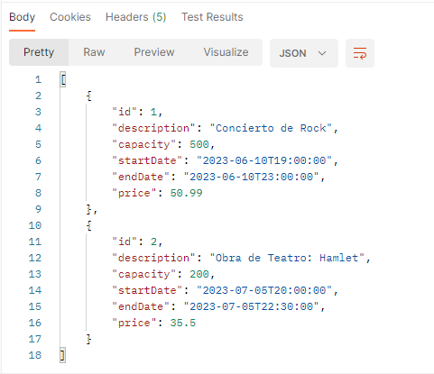
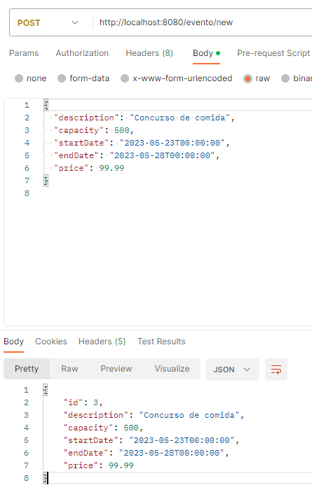
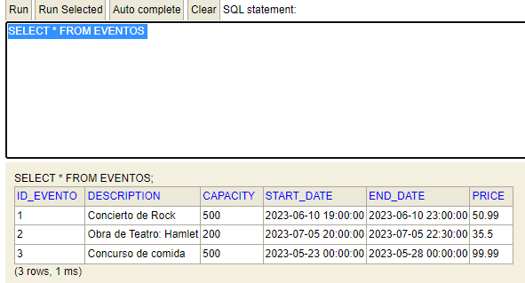
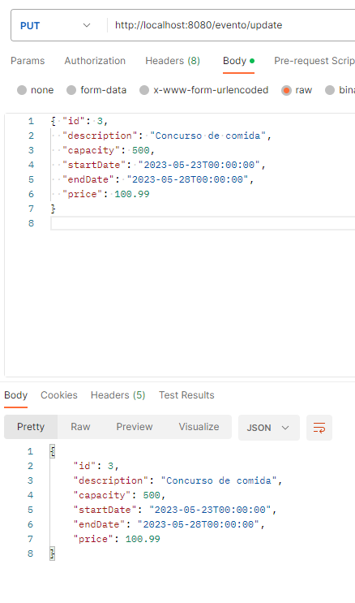
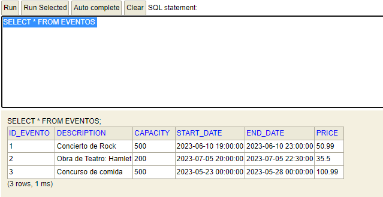
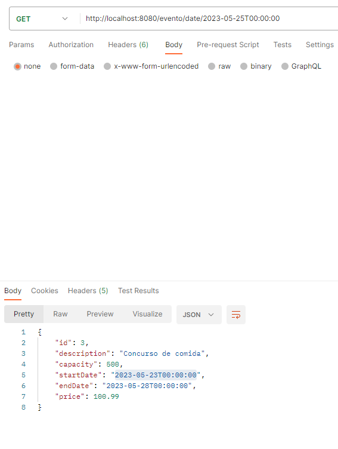
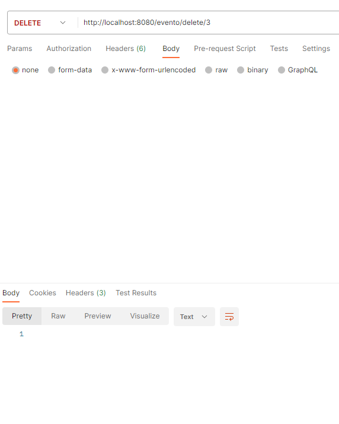
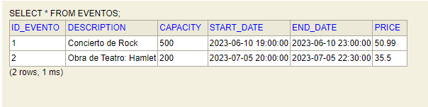

# Implementación de Microservicios

**Enunciado:**
Implementar un microservicio para un sistema de gestión de eventos. Debe permitir crear, actualizar, eliminar eventos y consultar por fecha.

Estoy utilizando *Arquitectura hexagonal*, también conocida como arquitectura de puertos y adaptadores. La principal idea es separar las preocupaciones
y dependencias externas del núcleo de la aplicación. 

**¡IMPORTANTE!** El microservicio se ha documentado con JavaDoc para intentar dejarlo lo más claro posible. 

El fin de este documento es hacer un pequeño manual de lo que nos devuelve *Postman*. 

En proyecto está dividido en los siguientes módulos:
* **Domain**: Tenemos la entidad de negocio con anotaciones de *lombok* para ahorrar código. En este módulo también tenemos el repository que vamos a usar juntos con los casos de uso.
* **Application**: Aquí tenemos la implementación de los casos de uso declarado en la capa *domain*. Tenemos la anotación **@Component** para indicar que es un componente de Spring. 
* **Infrastructure**: En este capa tenemos todo lo relacionado con la base de datos. Tenemos una entidad con anotaciones **JPA**, contiene también el repository que extiende de JPA, junto con la clase que lo implementa y las clases necesarias para realizar el mapeo.
* **Boot**: En este módulo tenemos la clase *main* para poder arrancar la aplicación. 

***

## Manual para Postman 

1. Vamos a probar que nos devuelva la lista con todos los eventos en la Base de datos.
   http://localhost:8080/evento
   
2. Ahora vamos a probar el método para crear un evento nuevo. En este caso no se añade **id** ya que lo genera automáticamente

En la base de datos nos aparece así:

3. Vamos a modificar el precio de un Evento. En este caso hay que pasar el **id** del evento que queremos modificar. 

En la base de datos nos aparece con el nuevo precio. 

4. Ahora vamos a consultar por fecha un evento.

5. Por ultimo, vamos a eliminar el evento con el id 3.

En la base de datos ya no nos aparece. 

